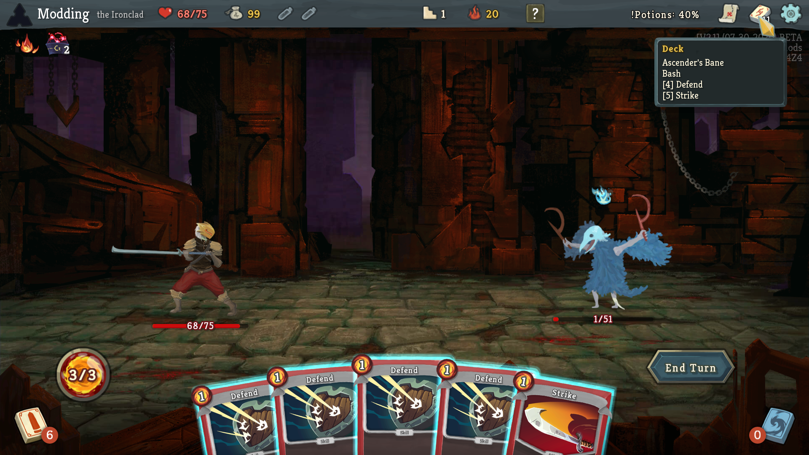
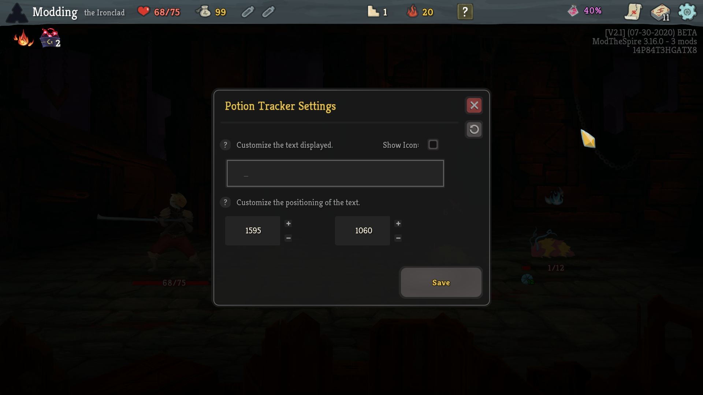

**No longer being developed! Check out:**

https://github.com/casey-c/infomod2 

https://github.com/casey-c/bestiary 

**...the more polished successors of this project!**

---

# InfoMod

InfoMod is a mod for Slay The Spire designed to help make hidden or lesser known game mechanics more visible to the player seeking to improve their game. It is *NOT* a cheat mod, and does not provide any additional information that the player cannot access without it (via tedious calculation or lookup). It is an in-game spiritual successor to SpireTool, an external application that parsed save files to try and compute useful information to help improve decision making. 

It is heavily influenced by the ever-useful [reference spreadsheet](https://docs.google.com/spreadsheets/d/1ZsxNXebbELpcCi8N7FVOTNGdX_K9-BRC_LMgx4TORo4/edit#gid=1146624812) and seeks to provide a lot of that information in game. InfoMod also supports the [SlayTheRelics Twitch extension](https://steamcommunity.com/sharedfiles/filedetails/?id=1989770578) to allow the tool tips provided by this mod to be accessed by viewers.

Jump down to the [Installation](#installation) section below to learn how to get this mod in your game!

## Optional Modules

There are several included modules in InfoMod, and each one can be enabled or disabled via an in-game configuration menu. The current modules are:

### Monster Compendium

Right click monsters while in combat to reveal their AI and movesets. This overlay data is provided for every vanilla mob in the game with their Ascension 20 behaviors.

### Potion Tracking

Text is added to the top bar that shows the current chances for a potion to drop in future combat rewards, allowing better informed decisions on whether to use a potion in the current fight.

### Event Tracking / Rare Card Chances

A [?] box is added to the top bar. This box has tool tips showing the chances to see at least one rare card in the next combat reward (for either regular fights or elites), as well as a list of the events you can receive by visiting question mark floors. Also includes the chance to see a specific event in the list after 1 or 2 question mark floors, to help decide whether to hunt for a particular event left in the pool.

### Special Tool Tip Overrides

Better tool tips for the map and deck icons now include quick-access to some important information. The map icon will now show the upcoming (and past beaten) bosses, while the deck icon shows a list of the cards in text form. These two features are great for streamers as viewers can view the information at any point during combat with the SlayTheRelics extension.

## Additional Features

### Configuration Menu

Access an in game configuration menu (Main Menu -> Mods -> InfoMod -> Config) to enable or disable each module. You can make the game look as vanilla as you like (e.g. only enabling the "Monster Compendium" and tool tip options) or get the full experience with all the bells and whistles.

*(New in Alpha 0.5.5)* Access an in-run configuration menu. Just click the [?] box while in a run to customize the potion text area!

### Slay The Relics Integration

Built in support for this Twitch extension allows viewers access to all the tool tips provided by InfoMod while on desktop Twitch. This features currently only works in combat due to a limitation of the SlayTheRelics extension.

### More Features In Development

A few additional features will be coming in future releases, including adding tool tips for Gold (e.g. amount of gold from fights or chests, range of prices in shops, etc.) and improvements to the existing tool tips to make them more user friendly.

## Installation

Getting InfoMod working requires ModTheSpire and BaseMod, both of which can be found on the Steam Workshop. Once you have acquired and installed those two prerequesites, head over to the [Releases page](https://github.com/casey-c/spiretool-infomod/releases) and download the most recent version of this mod.

You will need to download the InfoMod.jar file (not the source code zips) and place it into your SlayTheSpire/mods directory to have it work. 

Future releases of InfoMod will come to the Steam Workshop to make this process easier (and gain auto-updating benefits), but for now you'll have to check back periodically for updates!

*NOTE:* InfoMod is still in development. If you find bugs or run into problems, please let me know - thanks!

## Bug Reports, Issues, and Errors

If you find a bug / crash or other issue with InfoMod, please start an issue [here on Github](https://github.com/casey-c/spiretool-infomod/issues) with as many details as you can provide, as well as any helpful information that might help me reproduce the problem on my end.

If you find any typos or errors within the Monster Compendium (wrong AI / damage etc.), please let me know after you confirm the mistake against the [reference spreadsheet](https://docs.google.com/spreadsheets/d/1ZsxNXebbELpcCi8N7FVOTNGdX_K9-BRC_LMgx4TORo4/edit#gid=1146624812). I had to transcode a lot of these details manually, so it is more than possible that I made mistakes! Please note that currently the Monster Compendium is only built for A20 movesets (as it was a ton of work just to get that working!), but if you would like to help build it for lower ascensions, please leave me a message [here on the issues page](https://github.com/casey-c/spiretool-infomod/issues).

## Suggestions, Requests, and Other Contributions

Additional requests, desired improvements, and other feedback is more than welcome. Please leave a note over on the [issues page](https://github.com/casey-c/spiretool-infomod/issues) here on Github. This project is MIT licensed and more than happy to accept high quality merge requests or additional contributions. Get in touch via the issues page!
